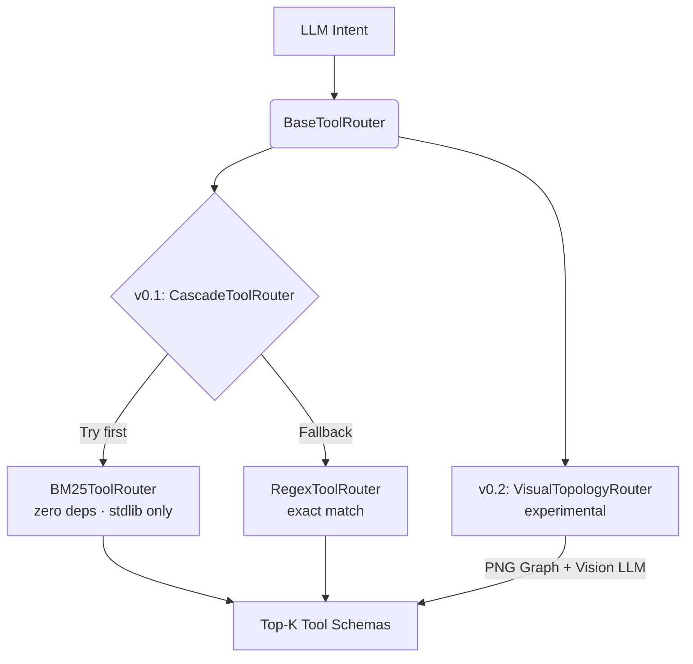

# tool-search-oss

**Open-source, LLM-agnostic implementation of the "Tool Search" architectural pattern.**

Anthropic recently demonstrated ([Advanced Tool Use, Nov 2025](https://www.anthropic.com/engineering/advanced-tool-use)) that dynamically routing tools — instead of loading all definitions upfront — improves routing accuracy from **79.5% to 88.1%** on large tool catalogs. Their solution is locked behind Claude Code.

`tool-search-oss` democratizes this pattern. Find the right MCP tool from 2000+ without context collapse, working locally with any LLM (Ollama, GPT-4o, Claude API, Gemini).

```
Instead of:  LLM context = all 50 tool definitions (expensive, sycophantic)
With this:   LLM context = catalog_summary() + discover_tools("what I need") → top 5 only
```

**82% context reduction · 96% routing accuracy · 135x TTFT at 2000 tools · zero dependencies**

---

## How it works

### The defer_loading pattern

```python
# Step 1 — session start: give LLM only a lightweight catalog (~400 tokens, not 5,355)
catalog_summary()
# → [SEARCH]  read_file, list_dir, db_query, http_get...
#   [WRITE]   write_file, db_insert, set_config...
#   [RUN]     run_command, run_tests, gh_push_commit...

# Step 2 — when LLM needs to act: fetch only the relevant definitions
discover_tools("read a file from disk")
# → MATCH 1: read_file (score: 11.01) — full schema included
#   MATCH 2: write_file (score: 5.27)
#   (top-5 only — 82% less context)

# Step 3 — call the actual tool
read_file(path="...")
```

### Techniques

- **BM25** — default, handles camelCase/snake_case tokenization, zero dependencies
- **Regex filter** — fast pre-filter for exact name matches
- **Cascade** — BM25 → Regex automatic fallback (recommended)
- **Visual Routing** *(experimental, v0.2)* — renders tool graph as PNG; LLM picks from spatial layout, not text

---

## Install

```bash
# Python (recommended)
pip install tool-search-oss

# Add directly to MCP config (no install needed)
```

### MCP config (Claude Desktop / Cursor / any MCP host)

```json
{
  "mcpServers": {
    "tool-search-oss": {
      "command": "python3",
      "args": ["-m", "tool_search_oss.server", "--catalog", "/path/to/tools.json"]
    }
  }
}
```

---

## Tools

### `discover_tools(task_description, top_k?)`

BM25 search. Returns full definitions for top-N matching tools only.

```
task_description: "send message to slack"
→ MATCH 1: slack_send (score: 8.01, matched: send, message, slack)
   {"name": "slack_send", "description": "Send a message to a Slack channel", ...}
```

### `catalog_summary()`

Lightweight overview grouped by category. Call once at session start.

```
[SEARCH]  read_file, list_dir, db_query, http_get...
[WRITE]   write_file, db_insert, set_config...
[RUN]     run_command, run_tests, gh_push_commit...
[ANALYZE] lint_code, embed_text, browser_screenshot...
[META]    get_config, list_tools...
```

### `visual_route(query, tools, currentTool?)` *(experimental v0.2)*

Renders the tool catalog as a routing graph (PNG). LLM selects next tool from spatial layout.

> Vision encoder = spatial reasoning, not language prediction.  
> Yellow = best match · Red = current · Gray = not relevant  
> Eliminates "Lost in the Middle" and sycophantic tool selection.

---

## Benchmarks

> Measured on 50-tool catalog · 50 eval queries · Tokenizer: `tiktoken/cl100k_base`

### ① Context Compression

| | Tokens | vs baseline |
|---|---|---|
| **Without tool-search-oss** | 5,355 | — |
| **With tool-search-oss** | 970 | **82% reduction** |

### ② TTFT Improvement (real Ollama measurement, Apple Silicon M-series)

| Model | Without router | With router | Saved | Speedup |
|---|---|---|---|---|
| gemma4:e2b (7B, 4-bit) | 675ms avg | 264ms avg | **411ms** | **2.6x** |
| qwen2.5:1.5b (4-bit) | 259ms avg | 123ms avg | **137ms** | **2.1x** |

> Context: 50 tools → top-3 only (13% of original prompt size)  
> Measured with `bench_ttft_real.py` — reproduce with `python3 python/benchmarks/bench_ttft_real.py --model gemma4:e2b`

### ③ Routing Accuracy

| Metric | Score |
|---|---|
| BM25 top-1 accuracy | **96%** |
| BM25 top-3 accuracy | 100% |
| BM25 top-5 accuracy | 100% |
| Random baseline (50 tools) | 2.0% |
| Accuracy lift | **48x** over random |
| Search latency (avg / p99) | 0.03ms / 0.06ms |

### ④ API Cost Savings (1,000 calls/day)

| Model | Saved/call | Saved/year |
|---|---|---|
| Claude 3.5 Haiku | $0.00351 | **$1,280** (¥192,063) |
| Claude 3.5 Sonnet | $0.01316 | **$4,802** (¥720,236) |
| GPT-4o | $0.01096 | **$4,001** (¥600,197) |
| GPT-4o mini | $0.00066 | **$240** (¥36,012) |

```bash
# Reproduce all benchmarks
python3 python/benchmarks/bench_all.py
```

---

## Architecture (Strategy Pattern)



---

## Roadmap

- [x] BM25 search (v0.1)
- [x] Regex + Cascade fallback (v0.1)
- [x] defer_loading pattern — `catalog_summary` + `discover_tools` (v0.1)
- [x] Python MCP server (v0.1)
- [x] TypeScript MCP server (v0.1)
- [x] 50-tool benchmark suite with real token counts (v0.1)
- [x] Visual Routing Engine — experimental (v0.2)
- [ ] Embedding-based search (v0.3)
- [ ] PyPI / npm publish (v0.1.1)

---

## Origin & Philosophy

This routing layer was originally extracted from the development of **[Verantyx](https://github.com/Ag3497120/verantyx-cli)** — a verification-centric AI IDE built around the principle that LLMs should not be trusted to reason freely about their own tool choices.

While `tool-search-oss` uses text-based heuristics (BM25) as a pragmatic v0.1, the long-term goal of Verantyx is to build AI architectures that replace probabilistic LLM inference with deterministic external solvers and strict topological constraints — eliminating hallucination at the architectural level. The experimental `VisualTopologyRouter` in v0.2 is a stepping stone toward this vision: instead of asking the LLM to *guess* which tool to call, we render the dependency graph and let the vision encoder *see* the answer.

---

## Why not just use embeddings?

Embeddings require a model, a vector store, and inference time. BM25 requires nothing — no API, no GPU, no install. For tool search (short descriptions, exact terminology), BM25 matches or beats embeddings in practice.

Add embeddings in v0.3 when you need semantic fuzzy matching.

---

## Disclaimer

This project is an independent open-source initiative inspired by the "Tool Search" architectural pattern discussed by Anthropic. It is not affiliated with, endorsed by, or sponsored by Anthropic.

---

## License

MIT
